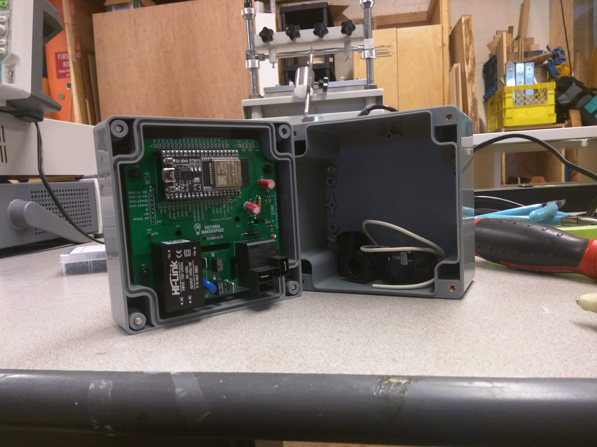
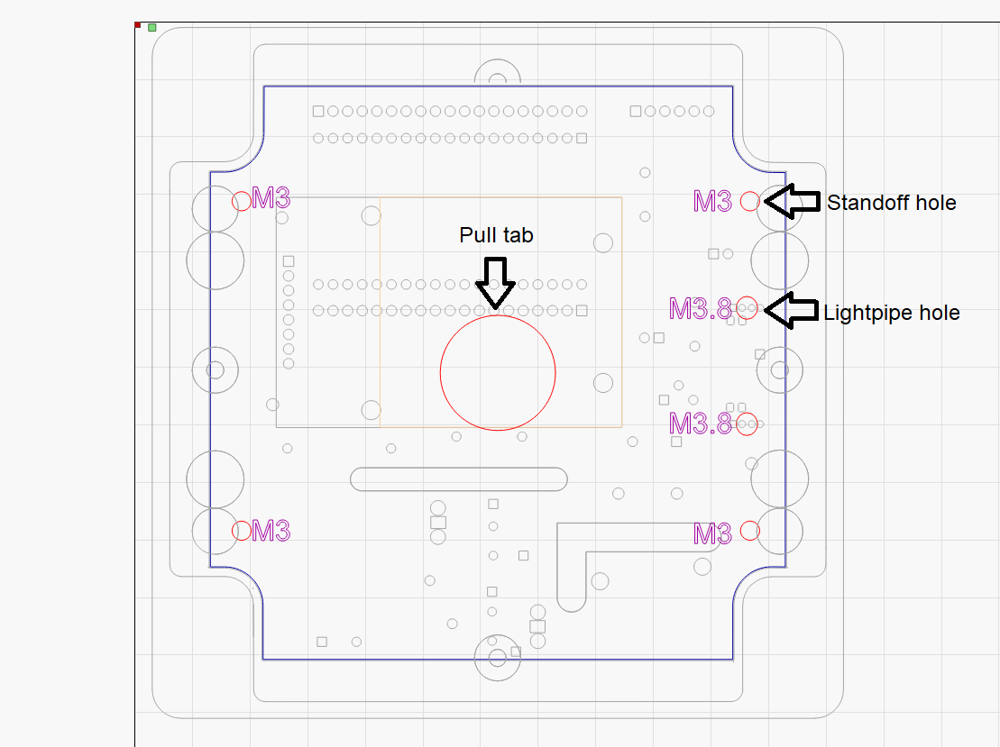
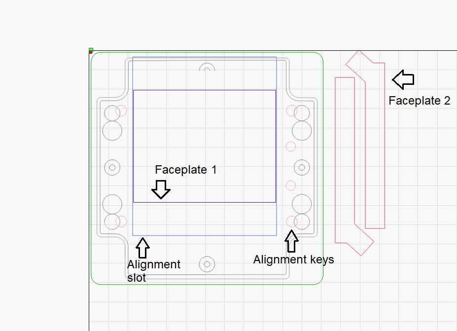

=========
Assembly
=========

Soldering
----------

.. important::

    The LEDs must be soldered last with the PCB mounted to the lid of its enclosure and the light pipes in place to ensure proper height of the LEDs off the back of 
    PCB.

Enclosure
-----------

The second physical revision of the tool access project can be mounted to the lid of a Multicomp G387 project box with four nylon M3 15mm (+6mm thread) standoffs and 
four M3 x 6mm nylon screws. The spacing is such that the RFID module will be pressed flush to the face of the project box lid. If additional rigidity for the RFID
module is desired a high quality double stick tape could be applied to the module.

Drillhole marking templates
^^^^^^^^^^^^^^^^^^^^^^^^^^^

:download:`Rev02DrillTemplate <./files/Rev02markingTemplate.lbrn>`

    Red layer - Drill holes for standoffs, lightpipes, and pull tab (for easy removal of template). Blue layer - snug fit outline. All else left in for visual orientation.

Faceplate + alignment template
^^^^^^^^^^^^^^^^^^^^^^^^^^^^^^^^

:download:`Rev02FaceplateTemplate <./files/Rev02FaceplateTemplate.lbrn>`

    The faceplate alignment template is designed to be used once the PCB has been mounted to te lid of its enclosure. Then key the template over the mounting hardware
    on the exterior of the lid. **Ensure that the LEDs are on the left**, then affix the card holder. This will ensure the AC portion of the PCB is in the bottom of the
    enclosure. 

.. note:: 

    If compatibility with keychain style FOB RFID tags is desired the flaceplate design included on this page will need to be modified.

Cable Gland Marking template
^^^^^^^^^^^^^^^^^^^^^^^^^^^^^

:download: `cableGlandTemplate <./files/cableGlandJig.lbrn>`

