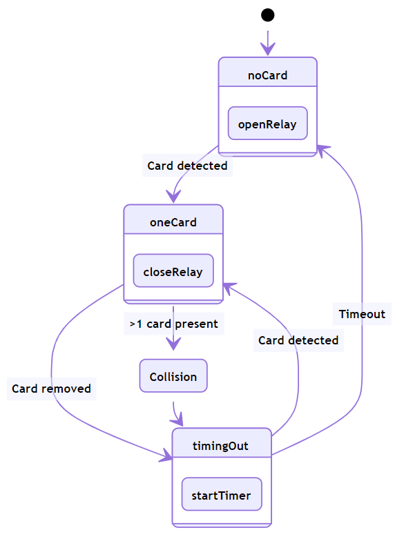

=========
Firmware
=========

The firmware for the tool access project is written primarily in Arduino flavoured C++. The RTOS "Real Time Operating System" (based on freeRTOS) that the Arduino
core for the ESP32 rides on top of is utilized in the RTOS branch for asynchronous task handling. Authentication of RFID cards is carried out at the server level
rather than at the tool level where the card is read. MQTT is utilized for asynchronous communication with the authentication sever. 

Linear vs RTOS Branches
--------------------------

The firmware for the tool access project has two branches as of |today|: Linear and RTOS. 

The linear branch is "standard" linear Arduino code. It can't query a database and instead uses a hardcoded UID's as a "stub" for authorization of cards. 

The RTOS branch utilizes the  RTOS running underneath the Arduino layer for more graceful task handling. The Arduino framework is still utilized to interact 
with peripherals but is wrapped in RTOS Tasks. This branch communicates with an MQTT broker via WiFi for authentication of RFID cards.


Learning RTOS on the ESP32
-----------------------------

1. `ESP32 Meet-up FreeRTOS <https://www.youtube.com/watch?v=E9FY-IOvC3Q>`_ I watched this on 1.75X to give me the basic gist of the RTOS API
2. `Mastering the FreeRTOS Real Time Kernel <https://www.freertos.org/wp-content/uploads/2018/07/161204_Mastering_the_FreeRTOS_Real_Time_Kernel-A_Hands-On_Tutorial_Guide.pdf>`_ This is an official freeRTOS resource. The ESP RTOS is based on it but is not exactly the same. I recommend skipping striaght to the section on Task Management.
3. `ESP-IDF FreeRTOS SMP Changes <https://docs.espressif.com/projects/esp-idf/en/latest/esp32/api-guides/freertos-smp.html>`_ Espressif's documentation for the differences bewteen ESP32's RTOS and vanilla freeRTOS
4. `ESP32 FreeRTOS API Reference <https://docs.espressif.com/projects/esp-idf/en/latest/esp32/api-reference/system/freertos.html>`_ The Espressif documentation for their flavour of FreeRTOS

.. warning::
   Do not solely utilizes the freeRTOS documentation without referencing Espressif's ESP32 specific RTOS documentation. 
   There are differences in how the two are implemented.


Tool Access Data Structures
-----------------------------

One of the constraints of working with RTOS is that tasks cannot be passed any number of variables like a regular function. Instead they take a single void point (void *).
RTOS has a number of tools for passing data between tasks such as queues, stream, and message buffers. Instead of using these more complex tools the Tool Access Firmware
simply passes the address of nested structures via the void pointer at task creation. This allows for the tasks to continue passing down the struct pointer to 
help functions they may need to call.

These nested structures are described in ```toolAccessRTOS.h```

.. code-block:: C++
   :linenos:

    // Struct for holding UID and manipulating of UID data type
    typedef struct {      
        byte uid_ByteBuffer[10]; // Holds UID read out of MFRC522 library
        byte uid_ByteLength;     // Holds size of uid_ByteBuffer
        byte uid_Test[10];
        // Holds the string version of the uid byte living in the mfrc522 struct
        size_t uidStrLen; // Holds the length (not size) of uidStr
        char uidStr[31]; // Biggest possible UID is 10bytes * 3 (because we : separate, eg. 0xFF:etc) + 1 (NULL) = 31
        // Counter used in detecting card collisions 
        char collCounter;     
    }cardParams;

    // Stuct for passing desired LED parameters
    typedef struct{ 
        int led; // # of LED in FastLED array
        int time; // blink rate
        bool blink; // whether to blink or not
        CRGB myColour; 
    } LEDParams;

    // Struct for holding timer information
    typedef struct{
        uint32_t ms_timeLast = 0;  // millisecond timer for holding last time was in a function.
        uint32_t ms_timeOut = 0; // Holds ms_timeOut count down for when card is removed.
        uint32_t ms_tooluseTime = 0; // Holds time relay was opened on timeout and therefore the time the tool was in use
        char min_tooluseTime = 0;
        uint32_t ms_relayStart = 0; // Holds time (milliseconds) at initial closing of relay
        uint32_t ms_wifi_outage = 0; // ?
    } Timers;

    // Struct for holding cardParams, LEDParams, and Timers
    typedef struct{
        LEDParams LEDParams0; // Parameters for LED0
        LEDParams LEDParams1;  // Parameters for LED1
        Timers timers;         // Instance Timers struct to hold all of our relevant timers
        cardParams card;      // Holds info about read card  
    } metaStruct;


metaStruct contains declared members of the other structs. It functions as a container who's address we may pass via the void pointer.

**Passing our structs via the void pointer**

.. code-block:: C++
   :linenos:
   
   // Example RTOS Tasks
   void pollNewTask (void *params){
         /* We may transfer our pointer address 
         from our void pointer to a new variable via casting*/
         metaStruct *progParams = (metaStruct*) params; 

        // We may now access our struct members like so 
        progParams->card.uidByte; // Only progParams is a pointer requiring the -> operator. 
        // After accessing via point we must use the . operator 
   }

   void setup(){
        // All code we wish to only run once is still placed in void setup

        // We declare a member of metaStruct, our container
        metaStruct progParams;

        // If any of our struct variables require initialization we do so
        progParams.LEDParams0.myColour = CRGB::Black; // We want our LEDs to start off
        progParams.LEDParams0.led = 0; // Notice that because we are still in setup we access
        progParams.LEDParams1.led = 1; // with the . operator all the way down our structs
        progParams.LEDParams0.blink = 0;
        progParams.LEDParams1.blink = 0;
   
        // Here we pass the address of just progParams to our pollNew Task via the void * parameter
        xTaskCreatePinnedToCore(pollNewTask, "pollNewTask", 2048, &progParams, 1, &pollNewHandle, 1);
   }

   void loop(){
   // Loop is not used when working with the RTOS 
   }
   


Peripheral Interactions
-----------------------
This section of the documentation focuses on the code I wrote to interact with the peripherals not on explaining how those peripherals work. Where a greater understanding of
the peripheral may be necessary in order to understand how my code works is the MFRC522 module which has its own page here.

RFID - MFRC522 Module
^^^^^^^^^^^^^^^^^^^^^^

The cheap and ubiquitous MFRC522 RFID module utilizes the NPX MFRC522 chip which is capable of a great deal more than it is used for in this project.
For our purposes all we need it to do is detect a MIFARE card and read it's UID. The server side of this project can associate UIDs with specific members. 

Technical documentation:

1. `List of status codes and types <https://docu.byzance.cz/hardware-a-programovani/programovani-hw/knihovny/mfrc522>`_
2. `Mario Capurso's write up using MFRC522 Arduino library <https://diy.waziup.io/assets/src/sketch/libraries/MFRC522/doc/rfidmifare.pdf>`_
3. `MFRC522 Datasheet <https://www.nxp.com/docs/en/data-sheet/MFRC522.pdf>`_
4. `MIFARE ISO/IEC 14443 PICC Selection <https://www.nxp.com/docs/en/application-note/AN10834.pdf>`_ 

Library\: `Miguelbaoboa MFR522 Arduino Library <https://github.com/miguelbalboa/rfid>`_. This library if no longer maintained by the original author but instead by community support.


.. warning::
   The ability to detect collisions (>1 card in RF field) is not functional on many of the cheap/ubiquitous RC522 modules available. 
   This is even called out in the Miguelbaoboa's RFID library where he speculates that it may be due to poor antenna design. Because of this the collision detection
   implemented in RFID library as per the datasheet recommendations does not function as it should.

Control Loop Utilized by Tool Access Project 
"""""""""""""""""""""""""""""""""""""""""""""

**States**

The control flow for the RFID hardware is state based. Our ESP should only close the relay under certain circumstances.
The states and the transitions between those states are a result of the number of RFID cards present in the modules RF field.

1. *No cards present* - in this state we poll for the arrival of new cards.
2. *One card present* - in this state we have detected a card. We must authorize it if the relay is to be closed. We must also shift from polling for new cards 
   to polling for the continued presence of our detected card and polling for a collision event.
3. *Collision (>1 card present)* - In this state we have detected a collision and we transition to Timeout state. Why is this done? We can detect the resolution 
   of a collision ie. one of the cards being removed however in the case of an unauthorized card colliding with an authorized one tailing in can be achieved by 
   careful removal of the authorized card. 
4. *timingOut* - In this state a timer is run down because either a collision has occurred or a card has been removed. This state can be exited by introducing
   a new card to reader or on expiration of the timer. Therefore we may think of it as occurring concurrently with the no cards present state. 



   All state transitions are conditional except for Collision goes to timingOut which occurs unconditionally. Authorization step omitted for clarity.

This state diagram holds true for both the Linear and the RTOS branches of the code. The states and state transitions are simply handled differently. In the linear
branches the states are tracked via boolean flag variables and transitions are made via conditional checks against those flags. In the RTOS branch this is done via 
EventGroups.

.. Note::
   The unconditional transition from the Collision state to the timingOut state is necessary due to the MFRC522 modules returning TIMEOUT status codes instead of
   COLLISION status code in the event of a collision. This does not prevent us from detect collisions but rather detecting how a collision is resolve.
   Therefore the decision was made to push all collisions to the timingOut state. 

State Transitions in RTOS
''''''''''''''''''''''''''''

In the RTOS branch of the code states are tracked via the EventBits contained within the EventGroup ``rfidStatesGroup``. The EventBits are interacted with via RTOS API calls
and macros defined in ``toolAccessRTOS.h``.

.. code-block:: C++
   :linenos:
   :caption: EventBit macros found in ``toolAccessRTOS.h``

   // Event group macros
   #define CARD_BIT_0 ( 1 << 0 )
   #define AUTH_BIT_1 ( 1 << 1 )
   #define RELAY_BIT_2 ( 1 << 2 )
   #define TIMEOUT_BIT_3 ( 1 << 3 )
   #define COLL_BIT_4 ( 1 << 4 )
   #define ESTOPFIRE_BIT_5 ( 1 << 5 )
   #define ESTOPCLEAR_BIT_6 ( 1 << 6 )
   #define WIFIOUT_BIT_7 ( 1 << 7 )

Not all of the EventBits are utilized to make state transitions but are set or cleared according to the state they are named for. 

The three main RTOS API calls used to interact with the Event bits are

.. code-block:: C++
   :linenos:

   xEventGroupClearBits(EventGroupHandle_t xEventGroup, const EventBits_t uxBitsToClear)); // Clears specified bits
   xEventGroupSetBits(rfidStatesGroup, (CARD_BIT_0|AUTH_BIT_1)); // Sets specified bits
   EventBits_t xEventGroupWaitBits(const EventGroupHandle_t xEventGroup,const EventBits_t uxBitsToWaitFor,const BaseType_t xClearOnExit,const BaseType_t xWaitForAllBits,TickType_t xTicksToWait);

Line one shows xEventGroupClearBits as the definition while line 2 shows xEventGroupSetBits as an actual call (they expect the same parameters).

.. important::
   ``CARD_BIT_0|AUTH_BIT_1`` are passed with :underline:`bitwise OR` because we are creating a bitmask to operator on the binary value contained within 
   rfidStatesGroup.

Line 3 once again shows a formal definition. xEventGroupWaitBits is the call used to gate state transitions. It blocks a task (not the processor) until the specified bits 
are set. :underline: `It cannot be used to check for being cleared`.  Notice that it can be configured to block until both specified bits are set or either bit is set. Additionally
it can clear the bits it checks on returning. 

COM12999 - Addressable LEDs
^^^^^^^^^^^^^^^^^^^^^^^^^^^^^
 
Library \: `FastLED <https://github.com/FastLED/FastLED>`_

blinky LED Task

MQTT
-------

Library\: `Async MQQT Client <https://github.com/marvinroger/async-mqtt-client>`_


Proposed Topic Structure
^^^^^^^^^^^^^^^^^^^^^^^^^^^
Technical documentation\:
`MQTT Topics & Best Practices <https://www.hivemq.com/blog/mqtt-essentials-part-5-mqtt-topics-best-practices/>`_

This is the proposed MQTT Topic Structure

.. code-block:: C++
   :linenos:
   
   // + single level wildcard
   // # multi level wildcard
   // wildcards may be used to subscribe to topics only not publish

   // Whoami - would allows tool to append hardcoded MQTT topics to include workshop/toolalias 
   tool/MAC // payload: workshop, toolalias

   // Workshops level topics
   tools/woodshop/toolalias
   tools/fasbshop/toolalias
   tools/machineshop/toolalias
   tools/electronics/toolalias
   tools/sewing/toolalias
   
   // Authorization topics
   tools/+/+/auth/req // payloads: UID
   tools/+/+/auth/rsp // payloads: auth|denied|seekiosk
   tools/+/+/auth/eou // uid
   
   // Estop topics
   tools/estop   // Makerspace level
   tools/+/estop // Workshop level
   tools/+/+/estop // Tool level
   
   // Logging topics
   tools/+/+/logs/ // payload: status
   tools/+/+/logs/status/rsp // payload: true, sizeoflog|false
   tools/+/+/logs/send // payload: req
   tools/+/+/logs/send //payload: JSON document holding logs?


# Roadmap to Further Development
## Optimization
### Interrupt functionality of the MFRC522 module
The MFRC522 chip supports interrupts generated on pin 5. The PCB design has left this pin unconnect so that is may be soldered to one of the ESP pins if desired. 

If this is to be pursued RTOS function calls will need to be changed to their ISR safe equivalents.

### Shrinking program size for OTA
For the over the air updates functionality to be used our program must occupty <50% of flash memory. As of 2020/08/07 it occupies ~59%. Additioanlly as part of the OTA process logs from tools will havbe to be requested and trasnmitted before the OTA is initiated as this process will likely overwrite the SPIFFS partition.

## Future features
## Potential Pitfalls

