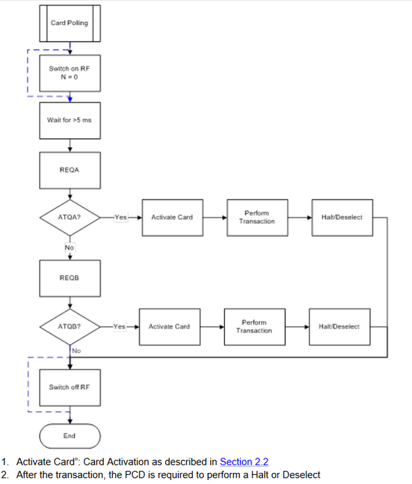
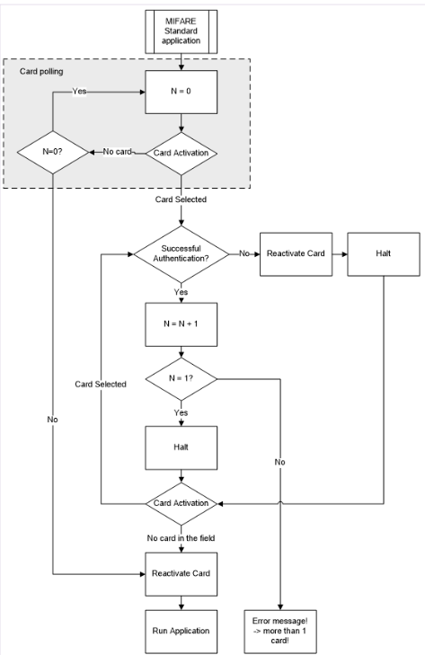

==================
MFRC522 - A Primer
==================

Technical documentation:

1. `MFRC522 Datasheet <https://www.nxp.com/docs/en/data-sheet/MFRC522.pdf>`_
2. `MIFARE ISO/IEC 14443 PICC Selection <https://www.nxp.com/docs/en/application-note/AN10834.pdf>`_ 

Purpose of this document
-------------------------

The purpose of this document is to provide a primer on how the MFRC522 module functions. For some understanding how the module works may assist in their understand of the
code written in the course of this project. NPX Semiconductor's MFRC522 RFID chip can do much more than it is used for in this project. Therefore I will only focus 
on how the MFRC522 functions so far as it is relevant to this project. 

.. sidebar:: Glossary of MFRC522 Technical Abbreviations & Terms

    .. glossary::
       PICC
          Proximity Integrated Circuit Card

       PCD
          Proximity Coupling Device

       UID
          Unique IDentifier number set by factory on each PICC (bytes 0..6 of block 0) may be be 4-10 bytes.

       SAK
          Select ACknowledge

       REQA/B
          REQuest, type A/B, polling command sent out by PCD ~5ms.

       ATQA/B
           Answer To reQuest, type A/B, response to REQ returned by PICC if present in RF field.

       WUPA
          Wake-Up Protocol, type A

       ACK
           ACKnowledge

       NAK
           Not AcKnowledge

       POR
          Power On Reset

       CRC
          Cyclic Redundancy Check

Manufacturer Recommended Control Loop
--------------------------------------

Card polling block diagram from `MIFARE ISO/IEC 14443 PICC Selection <https://www.nxp.com/docs/en/application-note/AN10834.pdf>`_ (Pg 5).

The MFRC522 polls for cards according to the diagram above. The RF field is switched on, if a card is present the RF field will provide power to the PICC which boots 
into an Idle state. The MFRC522 then sends out a REQA/B command (A/B are two different variants of the same command). If a PICC 
is present and in state Idle it will respond to a REQA with an ATQA. The MFRC522 may then proceed to activate that card and preform a transaction. For our purposes that 
transaction is the extraction of the UID.  

The extraction of that UID occurs during the card Activation and Authentication steps, shown below\:

Card selection block diagram (without MAD - MIFARE Multiple Application Directory) from `MIFARE ISO/IEC 14443 PICC Selection <https://www.nxp.com/docs/en/application-note/AN10834.pdf>`_ (Pg 10). 

Although represented in a slightly confusing manner the control flow diagrams provided by NPX (see above) layout how to interact with the RFID hardware. 

1. We poll for new cards. This is done by the MFRC522 broadcasts an REQA/B command. If a card is present in the RF field (and has had 5ms to boot) it will respond with a ATQA/B command.
2. We proceed to authenticating the card. This is where the UID is read.
3. If a collision occurs (ie. >1 card in the RF field).

