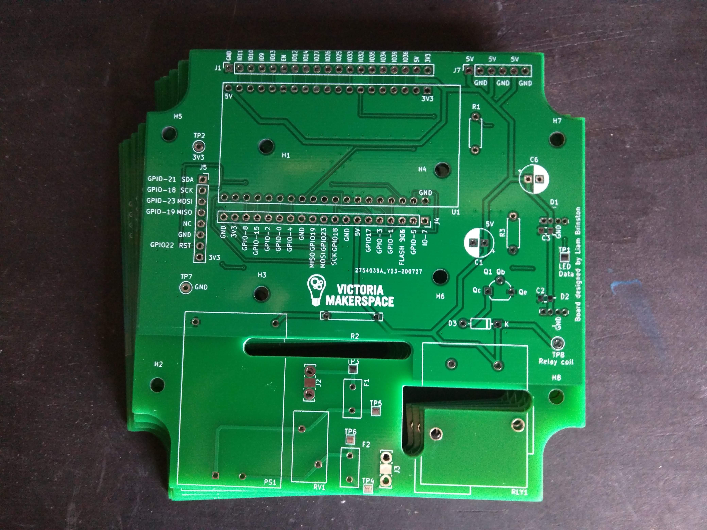
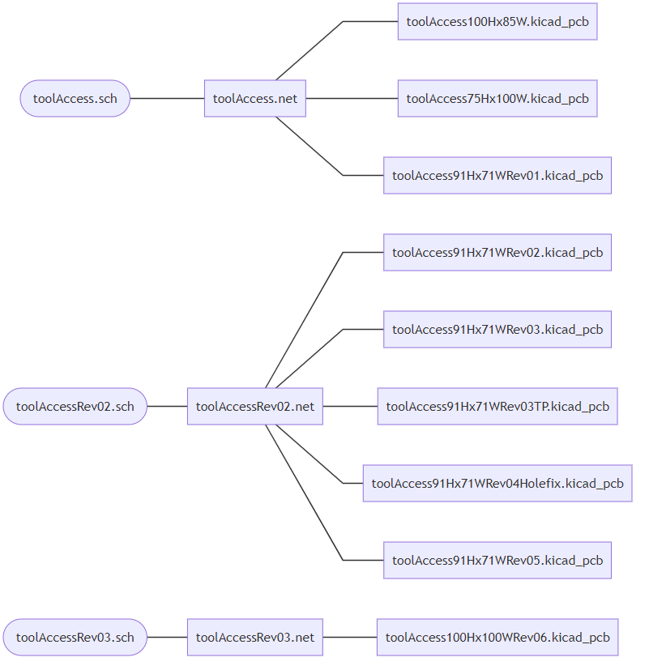
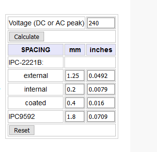
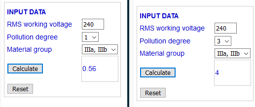
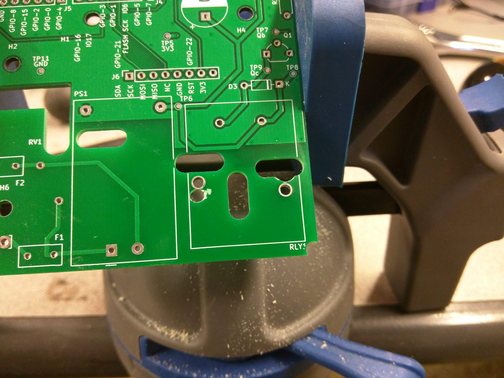
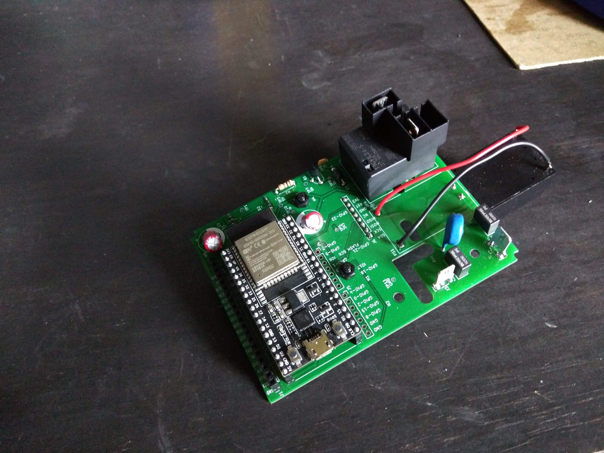
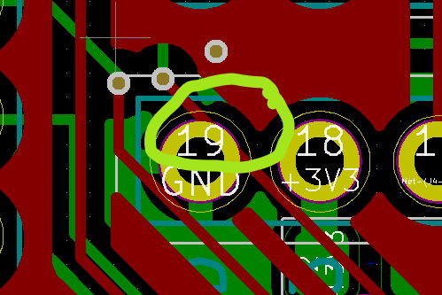

============
PCB Design
============

   Second physical revision of the tool access PCB (derived from toolAccess100Hx100WRev06).

Designed in\: `kiCAD <https://kicad-pcb.org/>`_

Learning PCB Design
--------------------

For those interested in learning to design their own PCBs. These are the resources I utilized during my co-op. They are focused on PCB design and PCB CAD tools not circuit theory.

* `Digi-Key's Intro to kiCAD: <https://www.youtube.com/watch?v=vaCVh2SAZY4/i>`_ this series alone taught me kiCAD. A heads up the version you use will likely be different. If an icon isn't where it appears in the video look in the comments for the new location.
* `Importing custom graphics into kiCAD <https://www.youtube.com/watch?v=w_7iRCyau7w>`_ - If you want to fancy up your boards.
* `PCB Trace Width Calculator <https://www.4pcb.com/trace-width-calculator.html>`_ - To help with determine trace sizes.
* `SnapEDA <https://www.snapeda.com/>`_ - Free symbol, footprint, and 3D model files

kiCAD Project Files
--------------------

This section contain all of the PCB design file made by myself (Liam Brinston) during my co-op term in the summer of 2020.

The have been broken out into project files of various sizes depending on what level of interest you may have.

Download the files, unzip them into your desired working directory, and then open the toolAccess.pro file from kiCAD > File > Open Project.

.. note::
   For either set of project files there are two sets of footprints and symbols that must be added to your kiCAD library paths\:
   
   1. Footprints made for this project - found in the toolAccess.pretty folder.
   
   2. Footprints and symbols libraries I acquired via SnapEDA - found in the libraries folder.
   
   It should be noted that the SPADE_TERMINAL_6.3MM.kicad_model files for the spade terminal (aka. FastOn) were modified by the author to include surface mount 
   solder pads in addition to through holes for additional rigidity.

**Most recent kiCAD Project files\:**
:download:`toolAccessPrjMaster.zip <./files/toolAccessPrjMaster.zip>`

These files are the most recent revision of the project used to produce the second iteration of the physical tool access prototype. Includes gerbers and drill files.

**Gerbers and drill files for most recent deisgn \:**
:download:`toolAcessMasterGerbers <./files/toolAccessMasterGerbers.zip>`

Just the gerbers and drill files for the most recent revision of the PCB.

**Complete Co-op 2020 kiCAD Project files\:**  
:download:`toolAccessPrjComplete.zip <./files/toolAccessPrjComplete.zip>`

The project file contains all of the revisions made by myself (Liam Brinston) during my co-op term in the summer of 2020. They are not all complete, some are merely part layouts while others are totally traced out. I have included this complete project file should it prove necessary to understand how the final design was arrived at. 

As this project is much larger with more revisions the file inheritance in the project can be referenced according to this diagram\:

   Inheritance diagram for the complete kiCAD project files. Showing which PCBNew files inherit from which eeSchema files via the netlist file.

**Makerspace Silkscreen Logo\:**
:download:`makerSpaceSilkLogo.zip <./files/makerSpaceSilkLogo.zip>`

AC creepage and clearance considerations
-------------------------------------------

Useful technical documentation:
| `High Voltage PCB Design Creepage and Clearance Distance <https://resources.altium.com/p/high-voltage-pcb-design-creepage-and-clearance-distance>`_
| `Advanced Circuits PCB trace width calculator <https://www.4pcb.com/trace-width-calculator.html>`_
| `Creepage calculator <https://www.smps.us/pcbtracespacing.html>`_
| `Grounding considerations <https://www.autodesk.com/products/eagle/blog/8-pcb-grounding-rules/>`_
| `CTI and PTI <https://db-electronic.com/en/pcb-manufacturing_s56.htm>`_
| `CTI Wikipedia page <https://en.wikipedia.org/wiki/Comparative_Tracking_Index>`_

Clearance - is the shortest distance through air between two conductors. Environmental conditions have a significant effect on this, primarily humidity changes.

Creepage - measures distances between two conductors along the surface of a high voltage PCB.  This requirement varies with the material of your PCB and can be increaed by slotting or routing air gaps between parts.

Our circuit has a small number of high voltage AC traces. Namely the spade terminals where AC power comes onto the boards, our HiLink Mains to 5V PSU, 
the protection circuitry for the PSU, and the relay contactor pins. These traces will operate at either 120V or 240V depending on the tool being controlled 
(the HiLink is capable of stepping down both). 

Determining creepage spacing
-----------------------------

* **Pollution degree**: Degree 1 - our circuit will be enclosed, dust proof, and indoors therefore falls under only dry non-conductive however, the fabrication shop does get very cold in the winter and can experience temperature swings over the course of the day so condensation is a possibility.
* **PCB material**: FR4
* **FR4 CTI**: 175 therefore material group IIIb.  
* **Max current (Signal lines)**: 40mA DC (ESP32 GPIO limit).
* **Max current (5V lines)**: 1A (DC limit of our PSU).
* **Max current (AC lines)**: 0.5A (AC limit of our PSU/Fuse threshold).

Given that our system could have either 120V or 240V supply we must plan for clearance and creepage at 240V. Additionally although our deployment mostly falls under pollution degree 1 using the spacing recommendations for spacing level 3 (where possible) will help us guard against edge cases.

   
   Clearance calculation at 240V
   Source: `Lazar's PCB Design Guide - Clearance <https://www.smps.us/pcbtracespacing.html>`_

   Creepage calculation at 240V pollution degree 1 and 3
   Source: `Lazar's PCB Design Guide - Creepage <https://pcbdesign.smps.us/creepage.html>`_
   Units: mm.

With these numbers in mind all AC traces were kept >1.25mm clear of one another and 5mm slots were routed between the high voltage AC side of the board and the 
low voltage DC side to achieve creepage distances of >4mm. Additionally all AC traces were excluded from the ground plane of the board.

BOM
-----

Bodge Gallery
---------------

Mistakes are part of prototyping. Humor and joy can be found in trying to fix these mistakes after the fact. So please enjoy this small gallery of design screw-ups
and after the fact repairs made in the course of this project.

**Prototype 1**

   I was so focused on making sure I didn't accidentally mirror the header placement for the RFID module I accidentally mirrored the footprint for the relay when I made
   it. Fortunately the placement of the AC pins wasn't so drastically different I couldn't correct for this with a rotary tool. It also helps that the board mount pins
   are soldered for mechanical strength only.

   I initially used the footprint for the smaller 5V 600mA HiLink board mount PSU without realizing. This mistake required a less subtle fix due to major difference in 
   dimensions between the two models.

**Prototype 2**

   Uncaught error in the kiCAD file (now fixed) causing the connection between the RFID modules SDA pin and the ESP32's pin 21 to short to ground. Surprisingly the 
   un-circled trace isn't shorted to ground but was none the less moved further for the ground pad in the next revision.

Fortunately this design error was easily corrected by severing the trace either side of the short and soldering a a wire from the SDA pin to pin 21.
